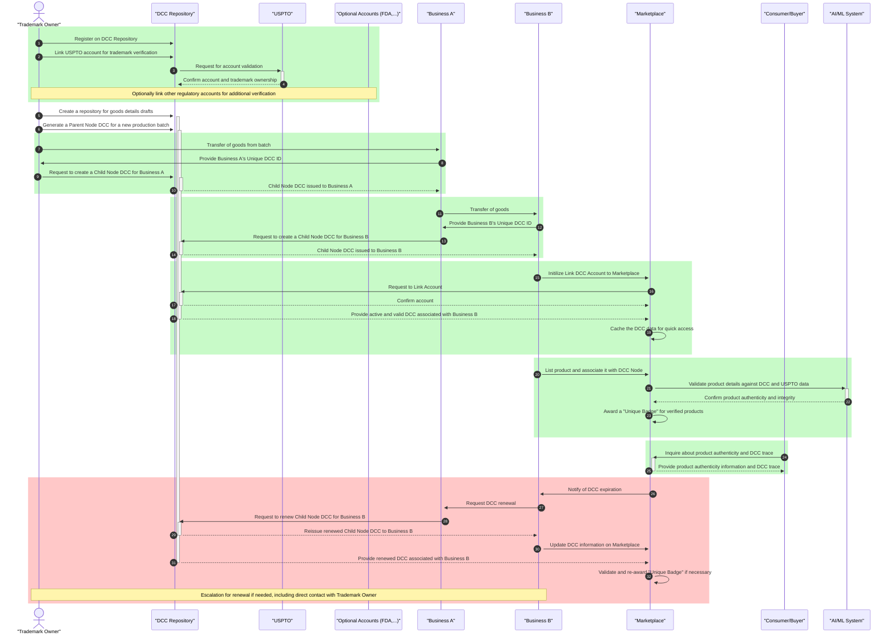

```mermaid
sequenceDiagram
    autonumber
    actor TrademarkOwner as "Trademark Owner"
    participant DCCRepo as "DCC Repository"
    participant USPTO as "USPTO"
    participant OptionalAccounts as "Optional Accounts (FDA,...)"
    participant BusinessA as "Business A"
    participant BusinessB as "Business B"
    participant Marketplace as "Marketplace"
    participant Consumer as "Consumer/Buyer"
    participant AMLSystem as "AI/ML System"

    %% Registration and Verification
    rect rgb(200, 250, 200)
        TrademarkOwner->>+DCCRepo: Register on DCC Repository
        TrademarkOwner->>+DCCRepo: Link USPTO account for trademark verification
        DCCRepo->>+USPTO: Request for account validation
        USPTO-->>-DCCRepo: Confirm account and trademark ownership
        Note over TrademarkOwner,OptionalAccounts: Optionally link other regulatory accounts for additional verification
    end

    %% Creating Repository and Parent Node
    TrademarkOwner->>+DCCRepo: Create a repository for goods details drafts
    TrademarkOwner->>+DCCRepo: Generate a Parent Node DCC for a new production batch

    %% B2B Transaction: Trademark Owner to Business A
    rect rgb(200, 250, 200)
        TrademarkOwner->>+BusinessA: Transfer of goods from batch
        BusinessA->>+TrademarkOwner: Provide Business A's Unique DCC ID
        TrademarkOwner->>+DCCRepo: Request to create a Child Node DCC for Business A
        DCCRepo-->>-BusinessA: Child Node DCC issued to Business A
    end

    %% B2B Transaction: Business A to Business B
    rect rgb(200, 250, 200)
        BusinessA->>+BusinessB: Transfer of goods
        BusinessB->>+BusinessA: Provide Business B's Unique DCC ID
        BusinessA->>+DCCRepo: Request to create a Child Node DCC for Business B
        DCCRepo-->>-BusinessB: Child Node DCC issued to Business B
    end

    %% Interaction with Marketplace
    rect rgb(200, 250, 200)
        BusinessB->>+Marketplace: Initilize Link DCC Account to Marketplace
        Marketplace->>+DCCRepo: Request to Link Account
        DCCRepo-->>-Marketplace: Confirm account
        DCCRepo-->>-Marketplace: Provide active and valid DCC associated with Business B
        Marketplace->>Marketplace: Cache the DCC data for quick access
    end

    %% Product Listing and Validation
    rect rgb(200, 250, 200)
        BusinessB->>+Marketplace: List product and associate it with DCC Node
        Marketplace->>+AMLSystem: Validate product details against DCC and USPTO data
        AMLSystem-->>-Marketplace: Confirm product authenticity and integrity
        Marketplace->>Marketplace: Award a "Unique Badge" for verified products
    end

    %% Consumer Interaction
    rect rgb(200, 250, 200)
        Consumer->>+Marketplace: Inquire about product authenticity and DCC trace
        Marketplace-->>-Consumer: Provide product authenticity information and DCC trace
    end

    %% Lifecycle Management
    rect rgb(255, 200, 200)
        Marketplace->>+BusinessB: Notify of DCC expiration
        BusinessB->>+BusinessA: Request DCC renewal
        BusinessA->>+DCCRepo: Request to renew Child Node DCC for Business B
        DCCRepo-->>-BusinessB: Reissue renewed Child Node DCC to Business B
        BusinessB->>+Marketplace: Update DCC information on Marketplace
        DCCRepo-->>-Marketplace: Provide renewed DCC associated with Business B
        Marketplace->>Marketplace: Validate and re-award "Unique Badge" if necessary
        Note over BusinessB,TrademarkOwner: Escalation for renewal if needed, including direct contact with Trademark Owner
    end
```